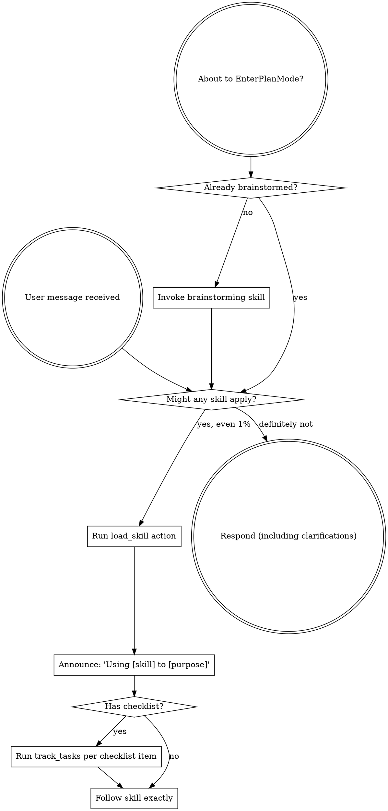

<EXTREMELY-IMPORTANT>
If you think there is even a 1% chance a skill might apply to what you are doing, you ABSOLUTELY MUST invoke the skill.

IF A SKILL APPLIES TO YOUR TASK, YOU DO NOT HAVE A CHOICE. YOU MUST USE IT.

This is not negotiable. This is not optional. You cannot rationalize your way out of this.
</EXTREMELY-IMPORTANT>

## Runtime Adapter

Use capability-based actions from `../_shared/runtime-compat.md`:
- `load_skill` to activate a skill before execution
- `track_tasks` when a skill includes checklist items
- Worker actions (`spawn_worker`, `message_worker`, `wait_worker`, `close_worker`) for multi-agent flows

Map these actions to your platform-native tools.

## Global Multi-Agent Enforcement Policy (Mandatory)

When work involves a written plan or 2+ potentially independent domains, enforce this policy.

1. Select exactly one orchestrator skill:
   - same-session plan execution -> `subagent-driven-development`
   - batch/checkpoint plan execution -> `executing-plans`
   - independent concurrent domains -> `dispatching-parallel-agents`
2. Run preflight before first worker spawn or fallback execution:
   - permissions/locks readiness
   - dependencies/tooling availability
   - known-failing exclusions or constraints
   - branch/worktree readiness
3. Before any completion claim, invoke `verification-before-completion` and provide fresh verification evidence.
4. If worker capabilities are incomplete, enter fallback behavior while preserving equivalent checkpoints.

### Mode Declaration (Required Once Per Session)

Declare these modes once before substantial execution:
- execution mode: `parallel-worker` or `fallback-serial`
- permission mode: `normal` or `git-write-restricted`

The declaration must match the contract in `../_shared/runtime-compat.md`.

### Routing Decision Table

| Task shape | Worker capability complete? | Permission mode | Required route |
| --- | --- | --- | --- |
| Written plan, mostly independent tasks, staying in current session | yes | normal | `subagent-driven-development` + `parallel-worker` |
| Written plan with batch checkpoints/handoff flow | yes/no | normal | `executing-plans` (`parallel-worker` when worker APIs exist, else `fallback-serial`) |
| 2+ independent concurrent domains | yes | normal | `dispatching-parallel-agents` + `parallel-worker` |
| Any of the above with incomplete worker actions | no | normal | keep chosen orchestrator semantics in `fallback-serial` |
| Any workflow with `.git/*.lock` permission failures on Git metadata writes | yes/no | `git-write-restricted` | continue selected orchestrator; switch Git-write behavior per runtime-compat contract |

# Using Skills

## The Rule

**Invoke relevant or requested skills BEFORE any response or action.** Even a 1% chance a skill might apply means that you should invoke the skill to check. If an invoked skill turns out to be wrong for the situation, you don't need to use it.

## Red Flags

These thoughts mean STOP—you're rationalizing:

| Thought | Reality |
|---------|---------|
| "This is just a simple question" | Questions are tasks. Check for skills. |
| "I need more context first" | Skill check comes BEFORE clarifying questions. |
| "Let me explore the codebase first" | Skills tell you HOW to explore. Check first. |
| "I can check git/files quickly" | Files lack conversation context. Check for skills. |
| "Let me gather information first" | Skills tell you HOW to gather information. |
| "This doesn't need a formal skill" | If a skill exists, use it. |
| "I remember this skill" | Skills evolve. Read current version. |
| "This doesn't count as a task" | Action = task. Check for skills. |
| "The skill is overkill" | Simple things become complex. Use it. |
| "I'll just do this one thing first" | Check BEFORE doing anything. |
| "This feels productive" | Undisciplined action wastes time. Skills prevent this. |
| "I know what that means" | Knowing the concept ≠ using the skill. Invoke it. |

## Skill Priority

When multiple skills could apply, use this order:

1. **Process skills first** (brainstorming, debugging) - these determine HOW to approach the task
2. **Implementation skills second** (frontend-design, mcp-builder) - these guide execution

"Let's build X" → brainstorming first, then implementation skills.
"Fix this bug" → debugging first, then domain-specific skills.

## Skill Types

**Rigid** (TDD, debugging): Follow exactly. Don't adapt away discipline.

**Flexible** (patterns): Adapt principles to context.

The skill itself tells you which.

## User Instructions

Instructions say WHAT, not HOW. "Add X" or "Fix Y" doesn't mean skip workflows.
